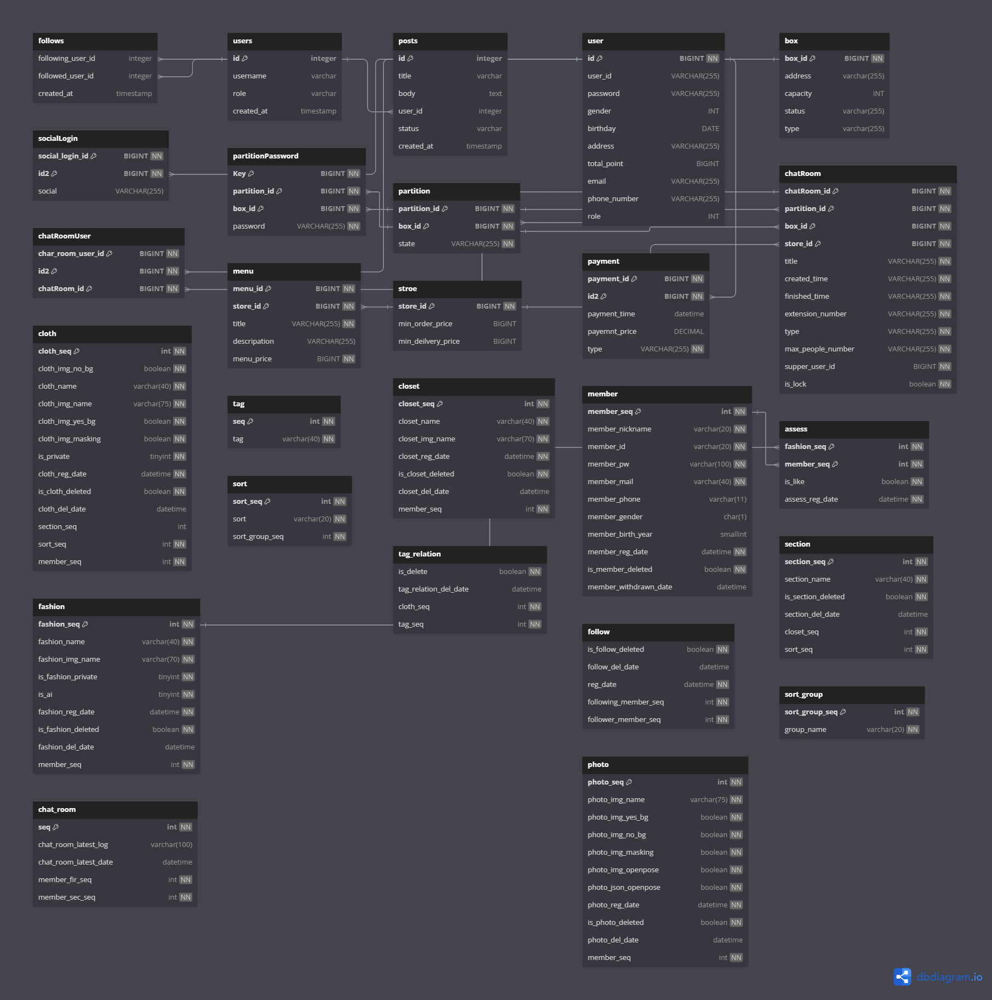
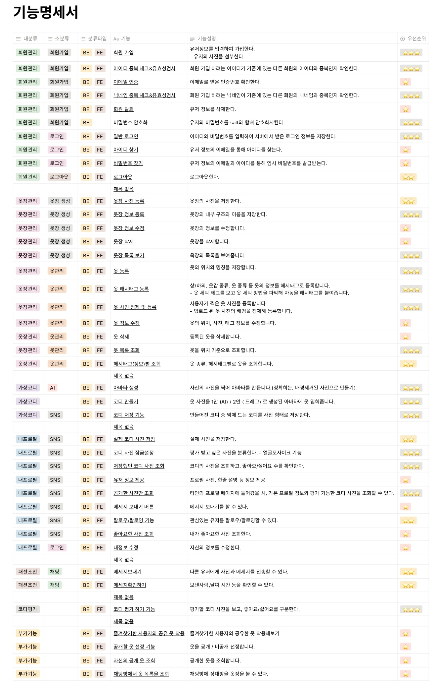

# 옷장을 기록하여 사용자가 자신의 옷을 관리하기 편하도록 도와주고 AI기반으로 사용자의 사진과 옷을 합성하여 자신이 만든 코디를 평가 받을 수 있는 서비스

# 📌기능 소개

### 1. 옷장 및 옷 관리
   - 옷장 및 옷 등록 및 관리
   - 옷장 및 옷 등록시 자동으로 사진의 배경을 제거
   - 카테고리, 옷장, 사용자 지정 태그 별로 옷 조회
   - 원하는 옷을 공개/ 비공개 설정

### 2. AI 합성 및 코디 평가
   - 회원의 사진을 아바타를 생성
   - 회원의 아바타와 옷 사진을 AI를 이용하여 합성하여 자동으로 옷을 입혀주는 기능
   - 합성한 사진을 저장
   - 스와이프 제스처를 통해 다른 사람의 코디를 평가하는 기능

### 3. 회원 관리 및 프로필 기능
   - 고객 정보 관리
   - 자신의 프로필을 들어가면 공개한 옷과 저장한 AI 사진을 조회
   - 남의 프로필을 들어가면 공개 설정한 옷과 AI 사진을 조회
   - AI 사진의 정보와 코디 평가에서 받은 좋아요와 싫어요 수 조회

# 📌프로젝트 진행 및 산출물

### 프로젝트 개발 기간

2023.10.10 ~ 2023.11.24

### 프로젝트 산출물

### 1. ERD

### 2. API 설계서

### 3. 요구사항 정의서

